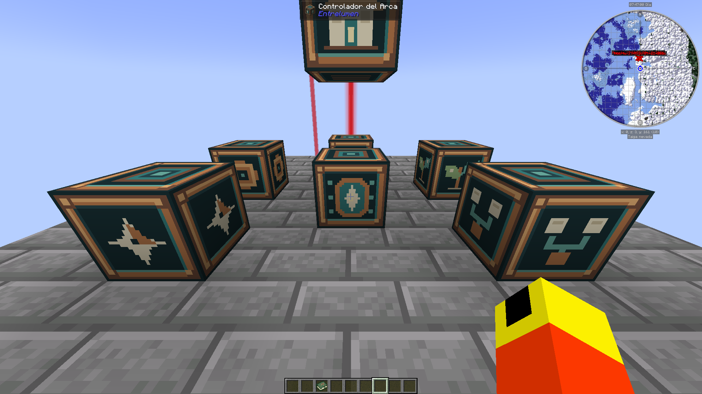

# Integrated collector validation — 2026-09-23

Real, untrimmed capture in the stationary creative Act VI QA fixture. **Not a representative base, route, survival playtest or pack performance acceptance.** `report.json` deliberately remains `incomplete`: `collector_validation` is not an acceptance scenario.

The native screenshot shows the actual 1920×1080 viewport before recording. Hardware: i7-8750H, GTX 1070, 16 GB RAM; Temurin 21.0.11+10-LTS, 8 GB heap, render 10 / simulation 6, no shaders, cap 120 FPS, vsync off. GPU driver 582.66; power/thermal state was not controlled. Seed 71942026; exact source revision, catalog hash and pre-session world hash are in the recorded configuration.

| Measurement | Observed |
| --- | ---: |
| Frame stream span | 394.895 s |
| Frames / ticks | 46,338 / 7,899 |
| Mean FPS | 117.34 |
| 1% low (`1000 / nearest-rank p99(frame_ms)`) | 73.55 FPS |
| Tick p95 | 15.17 ms |
| Whole-run observed TPS | 20.0003 |
| Maximum frame / tick | 97.09 / 241.04 ms |
| Frames above 50 ms | 10 |

The collector closed with zero pending rows, a verified shared clock and no invalid-segment reasons. Samples include native F2 screenshot overhead and the chat used to stop the run. None were removed. These are render-loop intervals and vanilla `tickServer` costs, not external GPU presentation timings or complete process costs. Whole-run TPS does not establish sustained TPS. Short memory/GC streams are retained but do not establish stability or the required two-hour soak.

`raw.zip` contains the original CSVs, session, integrity record and `probe-config.json`, byte-for-byte. `evidence.json` records their hashes, archive/screenshot hashes and cleanup. `report.json` preserves the analyzer result, with source paths normalized to archive member names. To reproduce metrics, extract the archive to an empty directory and, from the repository root, run:

```text
python tools/benchmark.py --config <extracted>/probe-config.json --frames <extracted>/frames.csv --ticks <extracted>/ticks.csv --output <extracted>/recomputed.json
```

Expected exit code: **2**, status **incomplete**, reason **scenario must be early_base, mid_base, late_base or exploration**. Passing numerical thresholds does not turn this fixture into an acceptance benchmark. Collector overhead A/B, representative loaded bases, exploration, sustained TPS, two-hour memory review and multiplayer remain open.

Minecraft saved all dimensions and exited normally. Only the three temporary fullscreen/viewport options were restored. Sky's fullscreen screenshot became stale/black during this session; native F2 screenshots and sample streams continued. This is a UI capture limitation, not evidence of a paused game.

## Español

Captura real e íntegra de 6 minutos y 35 segundos, con la cámara quieta en el escenario creativo del acto VI. Sirve para validar el colector y conservar una primera medición; **no acredita el rendimiento del pack**. Se conservaron todos los tirones, incluidas las capturas F2 y el chat final. Falta medir bases representativas con máquinas, exploración, estabilidad de dos horas y cooperativo. El cliente guardó y cerró normalmente, y se restauraron las opciones temporales.


